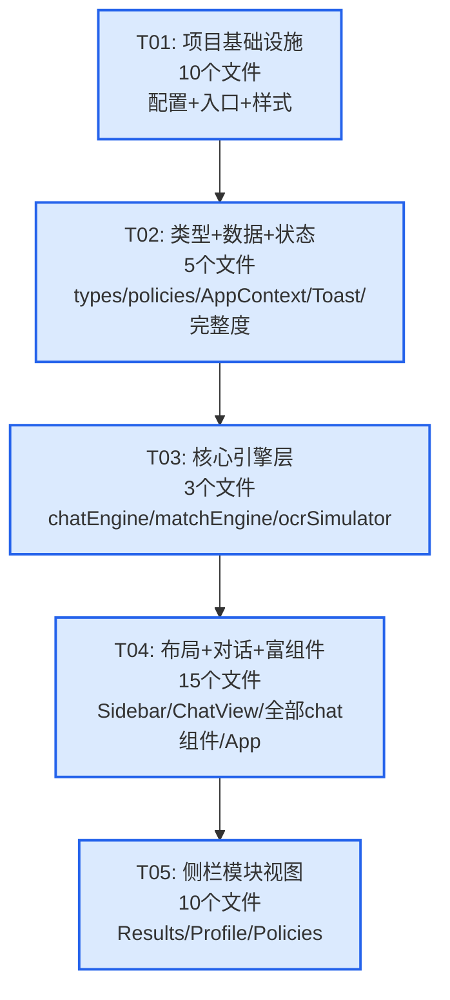

# 汇知道 V2 — 系统架构设计 + 任务分解

> 架构师：高见远  
> 项目路径：`E:\Hui zhidao\huizhidao-v2`  
> 技术栈：React 18 + Vite 6 + TypeScript + Tailwind CSS 3 + framer-motion + lucide-react

---

## 目录

- [Part A: 系统设计](#part-a-系统设计)
  - [1. 实现方案](#1-实现方案)
  - [2. 文件列表](#2-文件列表)
  - [3. 数据结构和接口](#3-数据结构和接口)
  - [4. 程序调用流程](#4-程序调用流程)
  - [5. 待明确事项](#5-待明确事项)
- [Part B: 任务分解](#part-b-任务分解)
  - [6. 依赖包列表](#6-依赖包列表)
  - [7. 任务列表](#7-任务列表)
  - [8. 共享知识](#8-共享知识)
  - [9. 任务依赖图](#9-任务依赖图)

---

## Part A: 系统设计

### 1. 实现方案

#### 1.1 核心技术挑战

| 挑战 | 解决方案 |
|------|----------|
| 对话流中嵌入富交互组件（上传区/进度条/画像卡/选项按钮/匹配结果卡） | 设计 `RichContent` 类型系统，ChatMessage 渲染时根据 `richContents[].type` 动态挂载对应组件 |
| 对话流状态机驱动（8个阶段自动流转） | 独立 `ChatEngine` 模块，纯函数式状态转换 `advancePhase(current, action) → next`，reducer 中调用 |
| 10条真实政策的规则匹配引擎 | `MatchEngine` 模块，每条政策对应一个 matcher 函数，评分制（0-100→high/medium/low/none），P006/P009 标记 background 不参与匹配 |
| 侧栏模块切换 + 导航回退栈 | `NavigationState` 维护 `moduleStack`，支持浏览器后退和模块间返回 |
| 模拟 OCR 解析动画 | `OcrSimulator` 模块，setTimeout 驱动4步进度动画，完成后回调预设画像数据 |

#### 1.2 架构模式

采用 **Context + Reducer** 状态管理模式（非 Redux，保持轻量）：

```
┌─────────────────────────────────────────────────┐
│                    App.tsx                       │
│  ┌───────────┐  ┌──────────────────────────┐    │
│  │  Sidebar   │  │      MainLayout          │    │
│  │  (64px)    │  │  ┌──────────────────┐   │    │
│  │  4个图标   │  │  │  ModuleRouter     │   │    │
│  │  导航入口   │  │  │  (chat/results/   │   │    │
│  │            │  │  │   profile/policies)│   │    │
│  └───────────┘  │  └──────────────────┘   │    │
│                  └──────────────────────────┘    │
│                                                  │
│  AppContext (useReducer)                         │
│  ├── state: AppState (phase, messages, profile…) │
│  ├── navigation: NavigationState                 │
│  └── actions: dispatch → ChatEngine/MatchEngine   │
└─────────────────────────────────────────────────┘
```

**数据流方向**：
- 用户交互 → ChatView dispatch action → Reducer 调用 ChatEngine/MatchEngine → 更新 AppState → React 重渲染 → ChatView 展示新消息

#### 1.3 框架与依赖选型

| 依赖 | 版本 | 用途 | 选型理由 |
|------|------|------|----------|
| react | ^18.3.1 | UI 框架 | V1 已用，保持一致 |
| react-dom | ^18.3.1 | DOM 渲染 | 同上 |
| lucide-react | ^0.462.0 | 图标库 | V1 已用，侧栏图标 + 各处图标 |
| framer-motion | ^11.0.0 | 动画过渡 | **V2 新增**：消息入场动画、模块切换过渡、OCR 进度动画 |
| typescript | ~5.6.2 | 类型系统 | V2 强制 TS |
| vite | ^6.0.1 | 构建工具 | 保持一致 |
| tailwindcss | ^3.4.15 | 原子化 CSS | 保持一致 |

#### 1.4 V1 代码复用策略

| V1 文件 | V2 处理 | 说明 |
|---------|---------|------|
| `types.ts` | **重写扩展** | 新增 ChatMessage/RichContent/MatchResult/NavigationState 等 |
| `AppContext.tsx` | **重写** | 从 useState 改为 useReducer，增加 navigation 状态 |
| `App.tsx` | **重写** | 从步骤路由改为侧栏+模块切换 |
| `index.css` | **扩展** | 保留基础样式，新增对话气泡/动画相关样式 |
| `Toast.tsx` | **直接复用** | 逻辑不变，移至 common 目录 |
| `UploadPage.tsx` | **拆分重构** | 拆为 UploadArea + OcrProgress，嵌入对话气泡 |
| `QuizPage.tsx` | **重构** | 对话式追问逻辑融入 ChatView + QuizOptions |
| `ProfilePage.tsx` | **重构** | 画像展示融入 ProfileCard 组件 + ProfileView 模块 |
| `ResultPage.tsx` | **拆分迁移** | 5个Tab拆为独立组件，迁移至 results/ 目录，数据源改为 matchResults |
| `HomePage.tsx` | **删除** | V2 无独立首页，欢迎消息在对话流中 |
| `StepNav.tsx` | **删除** | V2 无步骤导航，改为侧栏 |
| `tailwind.config.js` | **扩展** | 新增语义色配置 |

---

### 2. 文件列表

```
huizhidao-v2/
├── index.html                              # HTML 入口
├── package.json                            # 依赖声明 + 脚本
├── vite.config.ts                          # Vite 配置
├── tsconfig.json                           # TS 根配置
├── tsconfig.app.json                       # TS 应用配置
├── tsconfig.node.json                      # TS Node 配置
├── tailwind.config.js                      # Tailwind 主题扩展
├── postcss.config.js                       # PostCSS 配置
│
├── src/
│   ├── main.tsx                            # 应用入口，挂载 React
│   ├── App.tsx                             # 根组件：AppProvider + Sidebar + MainLayout
│   ├── index.css                           # Tailwind 指令 + 全局样式 + 对话气泡样式
│   │
│   ├── types.ts                            # 全局类型定义（所有 interface/enum/type）
│   │
│   ├── data/
│   │   └── policies.ts                     # 10条政策 JSON 数据 + 政策分类常量
│   │
│   ├── store/
│   │   └── AppContext.tsx                  # 全局状态：useReducer + Navigation + Toast
│   │
│   ├── engine/
│   │   ├── chatEngine.ts                   # 对话流状态机：阶段转换 + 消息生成
│   │   ├── matchEngine.ts                  # 政策匹配引擎：10条政策评分逻辑
│   │   └── ocrSimulator.ts                 # 模拟OCR：4步进度动画 + 预设画像
│   │
│   ├── hooks/
│   │   └── useToast.ts                     # Toast 通知 hook
│   │
│   ├── utils/
│   │   └── completeness.ts                 # 信息完整度计算 + 分项明细
│   │
│   └── components/
│       ├── layout/
│       │   ├── Sidebar.tsx                 # 64px 窄侧栏（4个图标导航 + Logo）
│       │   └── MainLayout.tsx             # 主区域容器（模块路由 + 过渡动画）
│       │
│       ├── chat/
│       │   ├── ChatView.tsx                # 对话咨询主视图（消息列表 + 输入区 + 自动滚动）
│       │   ├── ChatMessageItem.tsx         # 单条消息渲染（气泡 + 富组件挂载）
│       │   ├── ChatInput.tsx               # 输入区（动态：上传/选项/按钮/文本输入）
│       │   ├── UploadArea.tsx              # 简历上传区域（虚线边框 + 拖拽 + 示例数据按钮）
│       │   ├── OcrProgress.tsx             # OCR 解析动画（4步进度条 + 信息识别闪烁）
│       │   ├── ProfileCard.tsx             # 画像卡片（嵌入对话气泡，展示解析结果）
│       │   ├── QuizOptions.tsx             # 追问选项（单选/多选按钮组 + 确认按钮）
│       │   ├── MatchResultCard.tsx         # 政策匹配卡片（Top3 + 查看更多 + 匹配度胶囊）
│       │   ├── ProgressBadge.tsx           # 信息完整度徽章（环形/条形进度）
│       │   └── SuggestionCard.tsx          # 申报建议卡片（优先方向 + 行动步骤）
│       │
│       ├── results/
│       │   ├── ResultsView.tsx             # 查看结果主视图（5个Tab容器）
│       │   ├── PolicyMatchTab.tsx          # 政策匹配Tab（完整匹配列表 + 展开/折叠）
│       │   ├── QualificationTab.tsx        # 资格灯号Tab（红黄绿灯 + 优势短板）
│       │   ├── MaterialsTab.tsx            # 材料清单Tab（分类材料 + 状态标签）
│       │   ├── SuggestionTab.tsx           # 申报建议Tab（优先方向 + 行动计划）
│       │   └── ProfileCardTab.tsx          # 画像卡Tab（可分享卡片 + 导出/重置按钮）
│       │
│       ├── profile/
│       │   └── ProfileView.tsx             # 个人信息主视图（画像 + 追问答案 + 完整度明细）
│       │
│       ├── policies/
│       │   ├── PoliciesView.tsx            # 政策查阅主视图（列表 + 筛选搜索 + 分类标签）
│       │   ├── PolicyCard.tsx              # 政策列表卡片（名称/分类/关键词/匹配度）
│       │   └── PolicyDetail.tsx            # 政策详情页（完整信息 + 返回按钮）
│       │
│       └── common/
│           ├── Toast.tsx                   # Toast 通知（固定底部，自动消失）
│           └── MatchBadge.tsx              # 匹配度标签（胶囊形，high/medium/low三色）
```

**文件统计**：共 38 个文件（8 配置 + 30 源码）

---

### 3. 数据结构和接口

> 完整类图见 `docs/class-diagram.mermaid`

#### 3.1 核心类型定义（types.ts）

```typescript
// ============ 枚举类型 ============

/** 对话流阶段（状态机8个阶段） */
export type ChatPhase =
  | 'welcome'          // 欢迎节点
  | 'upload_guide'     // 上传引导
  | 'ocr_parsing'      // OCR解析中
  | 'profile_generated'// 画像已生成
  | 'quiz'             // 智能追问
  | 'matching'         // 政策匹配中
  | 'results'          // 结果展示
  | 'suggestion'       // 申报建议
  | 'completed';       // 完成

/** 匹配等级 */
export type MatchLevel = 'high' | 'medium' | 'low' | 'none';

/** 政策状态：normal=正常匹配, reference=参考展示(P003/P004), background=政策风向(P006/P009) */
export type PolicyStatus = 'normal' | 'reference' | 'background';

/** 侧栏模块类型 */
export type ModuleType = 'chat' | 'results' | 'profile' | 'policies';

/** 消息发送者类型 */
export type MessageType = 'ai' | 'user';

/** 富组件类型 */
export type RichContentType =
  | 'upload'           // 上传区域
  | 'ocr_progress'     // OCR解析动画
  | 'profile_card'     // 画像卡片
  | 'quiz_options'     // 追问选项
  | 'match_result'     // 政策匹配结果卡片
  | 'progress_badge'   // 信息完整度徽章
  | 'suggestion'       // 申报建议卡片
  | 'disclaimer';      // 免责声明

// ============ 数据模型 ============

/** 政策库条目（10条JSON） */
export interface Policy {
  id: string;              // P001-P010
  name: string;
  category: string;        // 创业扶持/人才补贴/人才计划/规范指导/赛事活动/招聘储备
  subcategory: string;
  target: string;
  conditions: string[];
  benefit: string;
  applyMethod: string;
  source: string;
  validPeriod: string;
  keywords: string[];
  matchRules: string;      // 自然语言描述的匹配规则（供 matchEngine 解析实现）
}

/** 人才画像（V1扩展，新增 overseasExp + achievements） */
export interface TalentProfile {
  name: string;
  age: number;
  education: string;       // 本科/硕士/博士
  major: string;
  currentRole: string;
  workArea: string;
  companyStage: string;
  industry: string;        // AI/科技创新/集成电路/生物医药...
  projectExp: string;
  highlights: string;
  talentType: string;      // 青年科技创新人才/海外回国人才...
  overseasExp: string;     // V2新增: 海外留学/工作经历
  achievements: string[];  // V2新增: 专利/论文/获奖/融资
}

/** 追问问题定义 */
export interface QuizQuestion {
  id: string;              // 对应 QuizAnswer 的 key
  question: string;        // AI 提问文本
  options: string[];       // 选项
  multi: boolean;          // 是否多选
}

/** 追问答案（V1扩展，新增 overseasExp + startupIntent） */
export interface QuizAnswer {
  socialInsurance: string;  // 社保缴纳: 已缴纳/未缴纳/不确定
  renting: string;          // 租房: 是/否/不确定
  workInXuhui: string;      // 徐汇工作: 是/否/不确定
  achievements: string[];   // 成果: 专利/论文/获奖/融资/重点项目/暂无
  overseasExp: string;      // V2新增: 海外经历: 海外留学/海外工作/无
  startupIntent: string;    // V2新增: 创业意向: 是/否/考虑中
  policyInterest: string;   // 政策偏好: 人才租房补贴/人才计划/创业扶持/落户/都想了解
}

/** 匹配结果 */
export interface MatchResult {
  policyId: string;
  policyName: string;
  matchLevel: MatchLevel;
  matchScore: number;              // 0-100
  status: PolicyStatus;            // normal/reference/background
  satisfiedConditions: string[];   // 已满足条件
  pendingConditions: string[];     // 待确认条件
  suggestion: string;              // 针对该政策的申报建议
}

/** 富组件内容（嵌入对话气泡下方） */
export interface RichContent {
  type: RichContentType;
  data: Record<string, any>;       // 各类型特有数据，运行时约定
}

/** 对话消息 */
export interface ChatMessage {
  id: string;                      // 唯一ID（timestamp + random）
  type: MessageType;               // ai | user
  content: string;                 // 气泡内文字
  richContents?: RichContent[];    // 气泡下方嵌入的富组件
  timestamp: number;
}

// ============ 状态类型 ============

/** 全局应用状态 */
export interface AppState {
  phase: ChatPhase;
  messages: ChatMessage[];
  profile: TalentProfile;
  quizAnswers: QuizAnswer;
  fileName: string;
  completeness: number;            // 0-100
  matchResults: MatchResult[];
  useDemoData: boolean;
  currentQuizIndex: number;        // 当前追问进度 (0-6)
}

/** 导航状态 */
export interface NavigationState {
  currentModule: ModuleType;
  moduleStack: ModuleType[];       // 导航回退栈
  policyDetailId: string | null;   // 政策详情ID（null=列表视图）
}

/** 完整度明细项 */
export interface CompletenessItem {
  label: string;
  filled: boolean;
  weight: number;                  // 权重（各项加总=100）
}
```

#### 3.2 RichContent.data 各类型约定

| type | data 字段 | 说明 |
|------|-----------|------|
| `upload` | `{ acceptedFormats: string }` | 上传区域，无额外数据 |
| `ocr_progress` | `{ steps: string[], currentStep: number, progress: number }` | OCR动画状态 |
| `profile_card` | `{ profile: TalentProfile }` | 画像数据 |
| `quiz_options` | `{ question: QuizQuestion, index: number }` | 当前问题 + 序号 |
| `match_result` | `{ results: MatchResult[], showAll: boolean }` | Top3或全部 + 展开状态 |
| `progress_badge` | `{ value: number, label: string }` | 完整度值 + 标签 |
| `suggestion` | `{ priority: string, actions: string[], tips: string[] }` | 建议数据 |
| `disclaimer` | `{ text: string }` | 免责声明文本 |

#### 3.3 服务层接口

```typescript
// ===== ChatEngine（对话流状态机）=====

interface ChatEngine {
  /** 根据当前阶段生成 AI 消息（含富组件） */
  getPhaseAction(
    phase: ChatPhase,
    context: { profile: TalentProfile; quizAnswers: QuizAnswer; quizIndex: number; matchResults: MatchResult[] }
  ): { messages: ChatMessage[]; nextPhase?: ChatPhase };

  /** 阶段转换：根据当前阶段 + 用户动作 → 下一阶段 */
  advancePhase(currentPhase: ChatPhase, action: string): ChatPhase;
}

// ===== MatchEngine（政策匹配引擎）=====

interface MatchEngine {
  /** 对所有政策执行匹配，返回排序后的结果 */
  matchAll(profile: TalentProfile, quizAnswers: QuizAnswer): MatchResult[];

  /** 单条政策匹配 */
  matchPolicy(policy: Policy, profile: TalentProfile, quizAnswers: QuizAnswer): MatchResult;
}

// ===== OcrSimulator（模拟OCR）=====

interface OcrSimulator {
  /** 启动模拟解析，通过回调报告进度 */
  start(
    onProgress: (step: number, progress: number, label: string) => void,
    onComplete: (profile: TalentProfile) => void
  ): void;

  /** 获取预设画像（示例数据） */
  getDemoProfile(): TalentProfile;

  /** 解析步骤文本 */
  getParseSteps(): string[];
}

// ===== AppContext（全局状态）=====

interface AppContextType {
  state: AppState;
  navigation: NavigationState;
  // 对话流操作
  dispatch: (action: ChatAction) => void;
  // 导航操作
  navigateTo: (module: ModuleType) => void;
  navigateBack: () => void;
  openPolicyDetail: (id: string) => void;
  closePolicyDetail: () => void;
  // Toast
  showToast: (msg: string) => void;
}

/** Reducer Action 类型 */
type ChatAction =
  | { type: 'INIT_CHAT' }
  | { type: 'ADVANCE_PHASE'; payload: { action: string; data?: any } }
  | { type: 'FILE_SELECTED'; payload: { fileName: string } }
  | { type: 'OCR_COMPLETE'; payload: { profile: TalentProfile } }
  | { type: 'OCR_PROGRESS'; payload: { step: number; progress: number } }
  | { type: 'QUIZ_ANSWER'; payload: { questionId: string; answer: string | string[] } }
  | { type: 'START_MATCHING' }
  | { type: 'LOAD_DEMO' }
  | { type: 'RESET_ALL' };
```

---

### 4. 程序调用流程

> 完整时序图见 `docs/sequence-diagram.mermaid`

#### 4.1 对话流状态机

```
                    ┌─────────┐
                    │ welcome │ ← 应用启动自动进入
                    └────┬────┘
                         │ 用户点击"开始咨询"
                    ┌────▼─────────┐
                    │ upload_guide │ ← AI引导上传 + 嵌入UploadArea
                    └────┬─────────┘
                         │ 用户选择文件 / 点击"使用示例数据"
                    ┌────▼──────────┐
                    │ ocr_parsing   │ ← AI消息 + 嵌入OcrProgress(4步动画,2.4s)
                    └────┬──────────┘
                         │ OCR完成回调
                    ┌────▼──────────────┐
                    │ profile_generated │ ← AI确认 + 嵌入ProfileCard + ProgressBadge(70%)
                    └────┬──────────────┘
                         │ 用户点击"继续补充信息"
                    ┌────▼────┐
                    │  quiz   │ ← 7个问题循环: AI提问+嵌入QuizOptions, 每答一题更新completeness
                    └────┬────┘
                         │ 7题全部答完
                    ┌────▼──────┐
                    │ matching  │ ← AI"正在匹配..." → 调用MatchEngine(1.5s延迟)
                    └────┬──────┘
                         │ 匹配完成
                    ┌────▼──────┐
                    │  results  │ ← AI总结 + 嵌入MatchResultCard(Top3) + disclaimer + "查看更多"
                    └────┬──────┘
                         │ 用户点击"查看申报建议"
                    ┌────▼──────────┐
                    │  suggestion   │ ← AI + 嵌入SuggestionCard(优先方向+行动步骤)
                    └────┬──────────┘
                         │
                    ┌────▼──────┐
                    │ completed  │ ← 可切换侧栏查看详细结果
                    └───────────┘
```

**状态转换条件表**：

| 当前阶段 | 触发动作 | 下一阶段 | 副作用 |
|----------|----------|----------|--------|
| welcome | action='start' | upload_guide | 追加AI引导消息+UploadArea |
| upload_guide | action='file_selected' | ocr_parsing | 追加AI消息+OcrProgress，启动OcrSimulator |
| ocr_parsing | action='complete' | profile_generated | 设置profile，追加AI消息+ProfileCard+ProgressBadge |
| profile_generated | action='continue' | quiz | 追加AI第一个问题+QuizOptions |
| quiz | action='answer' (非最后一题) | quiz(不变) | 记录答案，追加用户消息+下一题AI消息 |
| quiz | action='answer' (最后一题) | matching | 记录答案，追加AI"匹配中"消息，调用MatchEngine |
| matching | action='done' | results | 设置matchResults，追加AI总结+MatchResultCard |
| results | action='suggestion' | suggestion | 追加AI消息+SuggestionCard |
| suggestion | action='done' | completed | 无 |

#### 4.2 政策匹配引擎调用流程

```
matchAll(profile, quizAnswers)
  │
  ├─ 读取 POLICIES[10] (from data/policies.ts)
  │
  ├─ 遍历每条政策:
  │    ├─ 读取 policy.matchRules
  │    │
  │    ├─ 判断 status:
  │    │    ├─ P006, P009 → status='background' (跳过匹配, 仅在政策查阅"政策参考"分区展示)
  │    │    ├─ P003, P004 → status='reference' (执行匹配, 标注"参考"展示)
  │    │    └─ 其他 → status='normal'
  │    │
  │    ├─ 执行对应 matcher 函数 (评分制):
  │    │    ├─ P001: age≤35(+30) + 创业经历(+40) + 社保(+15) + 技能(+15)
  │    │    ├─ P002: 学历≥本科(+25) + 租房(+30) + 徐汇工作(+20) + 海外重点产业(+25)
  │    │    ├─ P003: 海外留学(+50) + age≤45(+30) + 来沪意向(+20)
  │    │    ├─ P004: 8大重点产业(+40) + 薪资≥30万(+30) + 知识产权(+15) + 研发投入(+15)
  │    │    ├─ P005: age≤30(+35) + 科技/AI方向(+35) + 创业意向(+30)
  │    │    ├─ P007: 学习意向(+40) + AI/创业方向(+30) + 活动匹配(+30)
  │    │    ├─ P008: 应届硕博(+35) + 年龄达标(+25) + 院校符合(+25) + 方向匹配(+15)
  │    │    └─ P010: AI/技术方向(+40) + 创业意向(+30) + 参赛意向(+30)
  │    │
  │    ├─ score → matchLevel:
  │    │    ├─ ≥70 → 'high'
  │    │    ├─ ≥40 → 'medium'
  │    │    ├─ ≥20 → 'low'
  │    │    └─ <20 → 'none'
  │    │
  │    └─ 生成 satisfiedConditions[] + pendingConditions[] + suggestion
  │
  ├─ 按 matchScore 降序排序
  ├─ 过滤 status='background' (P006, P009 移至政策参考分区)
  └─ 返回 MatchResult[]
```

#### 4.3 侧栏模块切换 + 回退流程

```
NavigationState 维护:
  - currentModule: 当前激活模块
  - moduleStack: 导航回退栈（push/pop）
  - policyDetailId: 政策详情ID（null=列表）

切换模块时:
  navigateTo('results')
    → moduleStack.push(currentModule)
    → currentModule = 'results'
    → MainLayout 根据 currentModule 渲染对应 View

回退时:
  navigateBack()
    → currentModule = moduleStack.pop()
    → 若 moduleStack 为空，currentModule = 'chat'

政策详情:
  openPolicyDetail('P005')
    → policyDetailId = 'P005'
    → PoliciesView 内部切换到 PolicyDetail

  closePolicyDetail()
    → policyDetailId = null
    → 回到 PoliciesView 列表

浏览器后退:
  → 监听 popstate 事件
  → 若 policyDetailId != null → closePolicyDetail()
  → 否则 → navigateBack()
```

#### 4.4 富组件渲染流程

```
ChatMessageItem 渲染逻辑:
  1. 渲染气泡（AI: 浅蓝bg + 圆角16px 16px 16px 4px / User: 蓝bg白字 + 圆角16px 16px 4px 16px）
  2. 若 message.richContents 非空:
     遍历 richContents:
       ├─ type='upload'        → <UploadArea />
       ├─ type='ocr_progress'  → <OcrProgress />
       ├─ type='profile_card'  → <ProfileCard data={data.profile} />
       ├─ type='quiz_options'  → <QuizOptions data={data.question} />
       ├─ type='match_result'  → <MatchResultCard data={data.results} />
       ├─ type='progress_badge'→ <ProgressBadge data={data.value} />
       ├─ type='suggestion'    → <SuggestionCard data={data} />
       └─ type='disclaimer'    → 免责声明 div
  3. 富组件渲染在气泡下方（AI头像对齐），使用 framer-motion 入场动画
```

---

### 5. 待明确事项

| # | 待明确 | 当前假设 |
|---|--------|----------|
| 1 | 追问问题数量 | 假设7题（V1的5题 + 新增"海外经历"+"创业意向"以覆盖P003/P005/P010匹配） |
| 2 | 示例画像数据 | 复用V1的王同学数据（28岁/硕士/AI产品经理/徐汇），新增 overseasExp='无'、achievements=['重点项目'] |
| 3 | 匹配评分阈值 | high≥70, medium≥40, low≥20, none<20（可根据测试调整） |
| 4 | 政策查阅筛选维度 | 按category分类筛选（创业扶持/人才补贴/人才计划/规范指导/赛事活动/招聘储备）+ 关键词搜索 |
| 5 | 对话流是否支持回退到上一阶段 | 不支持阶段回退（对话历史可上下滚动查看，但不支持修改已答问题重走流程） |
| 6 | "查看更多"交互 | 对话流内Top3展示，点击"查看更多"→自动切换到侧栏"查看结果"模块的"政策匹配"Tab |
| 7 | framer-motion 动画范围 | 消息入场(fadeInUp)、模块切换(fadeSlide)、OCR进度(scale)、匹配卡片(stagger) |

---

## Part B: 任务分解

### 6. 依赖包列表

```
# 生产依赖
react@^18.3.1                  # UI 框架
react-dom@^18.3.1              # DOM 渲染
lucide-react@^0.462.0          # 图标库（侧栏 + 各处图标）
framer-motion@^11.0.0          # 动画过渡（V2新增）

# 开发依赖
typescript@~5.6.2              # 类型系统
vite@^6.0.1                    # 构建工具
@vitejs/plugin-react@^4.3.3    # Vite React 插件
tailwindcss@^3.4.15            # 原子化 CSS
postcss@^8.4.49                # CSS 后处理
autoprefixer@^10.4.20          # CSS 自动前缀
@types/react@^18.3.12          # React 类型
@types/react-dom@^18.3.1       # React DOM 类型
```

---

### 7. 任务列表

> 遵循规则：最多5个任务，每任务≥3文件，T01为项目基础设施，按模块/层次分组

---

#### T01: 项目基础设施

**描述**：搭建 V2 项目骨架，配置所有构建工具和入口文件，确保 `npm run dev` 能启动空白页面。

| 项 | 内容 |
|----|------|
| **涉及文件** | `index.html`, `package.json`, `vite.config.ts`, `tsconfig.json`, `tsconfig.app.json`, `tsconfig.node.json`, `tailwind.config.js`, `postcss.config.js`, `src/main.tsx`, `src/index.css` |
| **依赖任务** | 无 |
| **优先级** | P0 |

**关键实现要点**：
- `tailwind.config.js`：扩展 colors.primary（深蓝#1e3a5f → 蓝#2563eb 全梯度）、semantic colors（success/warning/danger）
- `src/index.css`：保留V1全局样式，新增 `.chat-bubble-ai`（浅蓝bg + 圆角16px 16px 16px 4px）、`.chat-bubble-user`（蓝bg白字 + 圆角16px 16px 4px 16px）样式类
- `src/main.tsx`：挂载 `<App />`，暂不引入 AppProvider（T02添加）
- `package.json`：包含所有依赖，scripts: dev/build/preview

---

#### T02: 类型定义 + 数据层 + 状态管理

**描述**：定义全部 TypeScript 类型，写入10条政策数据，实现 AppContext（useReducer）全局状态管理。

| 项 | 内容 |
|----|------|
| **涉及文件** | `src/types.ts`, `src/data/policies.ts`, `src/store/AppContext.tsx`, `src/hooks/useToast.ts`, `src/utils/completeness.ts` |
| **依赖任务** | T01 |
| **优先级** | P0 |

**关键实现要点**：
- `src/types.ts`：按 §3.1 定义所有类型，导出常量：`QUIZ_QUESTIONS: QuizQuestion[]`（7题）、`INITIAL_PROFILE`、`INITIAL_QUIZ`
- `src/data/policies.ts`：导出 `POLICIES: Policy[]`（10条完整JSON），导出 `POLICY_CATEGORIES: string[]`
- `src/store/AppContext.tsx`：useReducer 实现 ChatAction 处理，包含 navigation 状态（navigateTo/navigateBack/openPolicyDetail/closePolicyDetail），暴露 showToast
- `src/utils/completeness.ts`：`calculate(profile, quiz)` 返回 0-100，`getBreakdown(profile, quiz)` 返回 CompletenessItem[]
- `src/hooks/useToast.ts`：封装 toast 状态管理（show + auto-dismiss 2.5s）

**QuizQuestions 定义（7题）**：
```typescript
const QUIZ_QUESTIONS: QuizQuestion[] = [
  { id: 'socialInsurance', question: '你目前是否已在上海连续缴纳社保？', options: ['已缴纳','未缴纳','不确定'], multi: false },
  { id: 'renting', question: '你目前是否在上海租房？', options: ['是','否','不确定'], multi: false },
  { id: 'workInXuhui', question: '你的工作单位是否注册或办公在徐汇区？', options: ['是','否','不确定'], multi: false },
  { id: 'achievements', question: '你是否有以下成果？（可多选）', options: ['专利','论文','获奖','融资','重点项目','暂无'], multi: true },
  { id: 'overseasExp', question: '你是否有海外留学或海外工作经历？', options: ['海外留学','海外工作','无'], multi: false },
  { id: 'startupIntent', question: '你是否有创业或参加创业赛事的意向？', options: ['是','否','考虑中'], multi: false },
  { id: 'policyInterest', question: '你希望优先了解哪类政策？', options: ['人才租房补贴','人才计划申报','创业扶持','落户相关','都想了解'], multi: false },
];
```

---

#### T03: 核心引擎层

**描述**：实现对话流状态机、政策匹配引擎、OCR模拟器三大核心引擎模块。

| 项 | 内容 |
|----|------|
| **涉及文件** | `src/engine/chatEngine.ts`, `src/engine/matchEngine.ts`, `src/engine/ocrSimulator.ts` |
| **依赖任务** | T02 |
| **优先级** | P0 |

**关键实现要点**：

**chatEngine.ts**：
- `advancePhase(current, action)`: 按 §4.1 状态转换表实现
- `getPhaseAction(phase, context)`: 返回该阶段需要追加的 AI 消息（含 richContents）
- 每个阶段的消息文本和富组件配置在此硬编码
- quiz 阶段根据 `context.quizIndex` 返回对应问题

**matchEngine.ts**：
- `matchAll(profile, quiz)`: 遍历10条政策，跳过 background 类
- 每条政策一个私有 matcher 函数（P001_matcher, P002_matcher...），返回 {score, satisfied, pending, suggestion}
- `scoreToLevel(score)`: ≥70→high, ≥40→medium, ≥20→low, <20→none
- P003/P004 标注 status='reference'，在展示时加"参考"标签
- 排序：按 matchScore 降序，high → medium → low → none

**ocrSimulator.ts**：
- `start(onProgress, onComplete)`: 4步动画，每步600ms间隔，总2.4s
- 步骤文本: ['AI正在解析简历...', '正在识别学历背景...', '正在提取项目成果...', '正在生成人才画像...']
- 完成后回调 `getDemoProfile()` 返回预设画像

---

#### T04: 布局 + 对话视图 + 富组件

**描述**：实现64px侧栏、主布局、对话咨询完整视图及全部对话内嵌富组件，组装 App.tsx。

| 项 | 内容 |
|----|------|
| **涉及文件** | `src/App.tsx`, `src/components/layout/Sidebar.tsx`, `src/components/layout/MainLayout.tsx`, `src/components/chat/ChatView.tsx`, `src/components/chat/ChatMessageItem.tsx`, `src/components/chat/ChatInput.tsx`, `src/components/chat/UploadArea.tsx`, `src/components/chat/OcrProgress.tsx`, `src/components/chat/ProfileCard.tsx`, `src/components/chat/QuizOptions.tsx`, `src/components/chat/MatchResultCard.tsx`, `src/components/chat/ProgressBadge.tsx`, `src/components/chat/SuggestionCard.tsx`, `src/components/common/Toast.tsx`, `src/components/common/MatchBadge.tsx` |
| **依赖任务** | T03 |
| **优先级** | P0 |

**关键实现要点**：

**Sidebar.tsx**：
- 64px 固定宽度，纯图标（lucide-react: MessageSquare/ClipboardCheck/User/Library）
- 4个导航项 + Logo（汇字图标）
- 当前模块高亮（蓝色左边竖线 + 背景色）
- 点击触发 `navigateTo(module)`

**MainLayout.tsx**：
- flex 布局：`<Sidebar /> + <main className="flex-1">`
- 根据 `navigation.currentModule` 渲染 ChatView / ResultsView / ProfileView / PoliciesView
- 模块切换用 framer-motion `AnimatePresence` + `motion.div` 实现淡入淡出

**ChatView.tsx**：
- 消息列表区（overflow-y-auto + 自动滚动到底部）
- 渲染 `messages.map(msg => <ChatMessageItem />)`
- 底部 ChatInput 区（根据 phase 动态显示不同输入组件）
- 消息入场用 framer-motion `motion.div` + `initial/animate`

**ChatMessageItem.tsx**：
- AI消息：头像（AI圆形）+ 浅蓝气泡 + richContents 渲染
- User消息：蓝色气泡白字（右对齐）+ 无 richContents
- richContents 遍历渲染对应组件

**ChatInput.tsx**：
- 根据 `state.phase` 和最后一条消息的 richContent 类型，动态展示：
  - upload_guide → "开始解析"按钮 + "使用示例数据"按钮
  - quiz → 选项按钮组（由 QuizOptions 组件渲染）
  - results → "查看申报建议"按钮 + "查看完整结果"按钮
  - completed → "重新咨询"按钮
  - 其他阶段 → 无输入区（等待AI处理）

**UploadArea.tsx**：
- 虚线边框 + 浅蓝背景（border-dashed border-blue-300 bg-blue-50）
- 拖拽上传 + 点击上传 + "使用示例数据"按钮
- 文件选择后显示文件名 + "开始解析"按钮

**OcrProgress.tsx**：
- 4步进度条（每步25%），framer-motion 动画
- 信息识别项闪烁（学历/专业/工作/创业/项目/论文/行业/人才类型）
- 从 richContent.data 读取 currentStep + progress

**MatchResultCard.tsx**：
- Top3 政策卡片，每张：政策名 + MatchBadge(胶囊形匹配度) + 已满足/待确认条件 + 建议
- "查看更多"按钮 → dispatch navigateTo('results')
- framer-motion stagger 入场动画

**其他组件**：按 §3.2 的 RichContent.data 约定实现

---

#### T05: 侧栏模块视图（结果/个人信息/政策查阅）

**描述**：实现查看结果、个人信息、政策查阅三个侧栏模块的完整视图。

| 项 | 内容 |
|----|------|
| **涉及文件** | `src/components/results/ResultsView.tsx`, `src/components/results/PolicyMatchTab.tsx`, `src/components/results/QualificationTab.tsx`, `src/components/results/MaterialsTab.tsx`, `src/components/results/SuggestionTab.tsx`, `src/components/results/ProfileCardTab.tsx`, `src/components/profile/ProfileView.tsx`, `src/components/policies/PoliciesView.tsx`, `src/components/policies/PolicyCard.tsx`, `src/components/policies/PolicyDetail.tsx` |
| **依赖任务** | T04 |
| **优先级** | P1 |

**关键实现要点**：

**ResultsView.tsx**：
- V1 ResultPage 迁移，5个Tab（政策匹配/资格灯号/材料清单/申报建议/画像卡）
- 数据源从硬编码改为 `state.matchResults` + `state.profile` + `state.quizAnswers`
- 顶部完整度展示 + 免责声明

**PolicyMatchTab.tsx**：
- 完整匹配列表（所有 normal + reference 策，按 matchLevel 分组）
- P003/P004 标注"参考"标签
- 每条可展开/折叠详情

**QualificationTab.tsx**：
- V1 灯号逻辑迁移，数据源改为动态计算（基于 matchResults 中的 satisfied/pending 条件）
- 优势/短板分析

**MaterialsTab.tsx**：
- V1 材料清单迁移，根据匹配政策动态生成材料列表
- 状态标签：已具备/建议准备/需要确认/可选补充

**SuggestionTab.tsx**：
- V1 申报建议迁移，优先方向基于 Top1 matchResult
- 行动步骤 + 简历优化建议

**ProfileCardTab.tsx**：
- V1 画像卡迁移，数据源改为 state.profile
- 复制报告/导出/重新咨询按钮（toast 交互）

**ProfileView.tsx**：
- 完整画像展示（头像 + 基本信息 + 详细字段 + 标签）
- 追问答案汇总（7题答案列表）
- 完整度明细（CompletenessItem[] 可视化：已填/未填 + 权重）

**PoliciesView.tsx**：
- 10条政策列表（PolicyCard 网格）
- 筛选：category 分类标签（全部/创业扶持/人才补贴/...）
- 搜索框：按 name/keywords 模糊搜索
- "政策参考"分区：P006/P009 单独展示（背景信息/合规提示，不参与匹配）
- 点击卡片 → `openPolicyDetail(id)`

**PolicyCard.tsx**：
- 政策名 + category 标签 + 关键词标签 + 简要 benefit
- 若已匹配，显示 MatchBadge
- P003/P004 显示"参考"角标

**PolicyDetail.tsx**：
- 政策完整信息（全部字段）
- 返回按钮 → `closePolicyDetail()`
- framer-motion 入场动画

---

### 8. 共享知识

#### 8.1 对话节点状态机约定

- **唯一状态源**：`state.phase`（ChatPhase 枚举），所有阶段转换通过 `dispatch({type:'ADVANCE_PHASE'})` 触发
- **阶段不可逆**：除 RESET_ALL 外，phase 只能前进不能后退
- **消息追加规则**：每次 phase 变化，ChatEngine.getPhaseAction() 返回的 messages 被 append 到 state.messages
- **用户消息**：用户交互（选答案/点按钮）时，先 append 用户消息，再触发 phase 转换 append AI 消息
- **消息ID**：`${Date.now()}-${Math.random().toString(36).slice(2,8)}` 保证唯一

#### 8.2 政策匹配规则引擎约定

- **评分制**：每条政策 matcher 返回 0-100 分，映射到 high(≥70)/medium(≥40)/low(≥20)/none(<20)
- **三类政策**：
  - `normal`（P001/P002/P005/P007/P008/P010）：正常参与匹配，在对话流和结果页展示
  - `reference`（P003/P004）：参与匹配但标注"参考"标签，在结果页正常展示
  - `background`（P006/P009）：不参与匹配，仅在政策查阅"政策参考"分区展示
- **排序规则**：matchScore 降序，同分按 policy.id 升序
- **Top3**：对话流内仅展示前3条（matchLevel ≠ none），"查看更多"跳转结果页

#### 8.3 组件嵌套渲染约定

- **ChatMessageItem 是富组件容器**：根据 `richContents[].type` 动态渲染子组件
- **富组件数据传递**：统一通过 `richContent.data` 传递，子组件 props 名为 `data`
- **富组件位置**：渲染在 AI 气泡下方，与 AI 头像左对齐，最大宽度 `max-w-md`（28rem）
- **交互回调**：富组件内的用户交互（选答案/点按钮）通过 props 回调 → ChatView → dispatch action
- **动画约定**：所有富组件入场使用 framer-motion `initial={{opacity:0, y:16}} animate={{opacity:1, y:0}}`

#### 8.4 颜色/样式约定

| 用途 | 色值 | Tailwind 类 |
|------|------|-------------|
| 深蓝（品牌/Logo/头像渐变起点） | #1e3a5f | `bg-[#1e3a5f]` 或 `primary-900` |
| 蓝（按钮/用户气泡/强调） | #2563eb | `bg-blue-600` 或 `primary-600` |
| 浅蓝（AI气泡背景） | #eff6ff | `bg-blue-50` |
| 白（卡片背景） | #ffffff | `bg-white` |
| 浅灰（页面背景） | #f8fafc | `bg-slate-50` |
| 绿（已满足/high匹配） | #22c55e | `bg-green-500` / `text-green-700` |
| 黄（待确认/medium匹配） | #f59e0b | `bg-amber-500` / `text-amber-700` |
| 红（不满足/low匹配） | #ef4444 | `bg-red-500` / `text-red-600` |

**气泡圆角约定**：
- AI气泡：`rounded-[16px_16px_16px_4px]`（左下小圆角）
- 用户气泡：`rounded-[16px_16px_4px_16px]`（右下小圆角）

**政策匹配卡片约定**：
- 白底 + `border border-slate-200` + `rounded-lg`（8px）+ `shadow-sm`
- 匹配度标签：右上角胶囊形 `rounded-full px-3 py-1 text-xs font-bold`

#### 8.5 V1 → V2 数据迁移约定

- 示例画像 `DEFAULT_PROFILE` 复用V1的王同学数据，新增字段：
  ```typescript
  overseasExp: '无',
  achievements: ['重点项目'],
  ```
- 示例追问答案 `DEFAULT_QUIZ` 新增：
  ```typescript
  overseasExp: '无',
  startupIntent: '考虑中',
  ```
- 示例完整度：OCR后70% → 追问完成后90%（7题每题约3%加成）

---

### 9. 任务依赖图



**任务总结**：

| 任务 | 文件数 | 依赖 | 优先级 |
|------|--------|------|--------|
| T01 项目基础设施 | 10 | 无 | P0 |
| T02 类型+数据+状态 | 5 | T01 | P0 |
| T03 核心引擎层 | 3 | T02 | P0 |
| T04 布局+对话+富组件 | 15 | T03 | P0 |
| T05 侧栏模块视图 | 10 | T04 | P1 |
| **合计** | **43** | | |

> **注**：文件总数含8个配置文件 + 30个源码文件 + 5个引擎/hooks/utils文件。T01-T04 为线性依赖链（P0关键路径），T05 为 P1 可与 T04 后半段并行。
